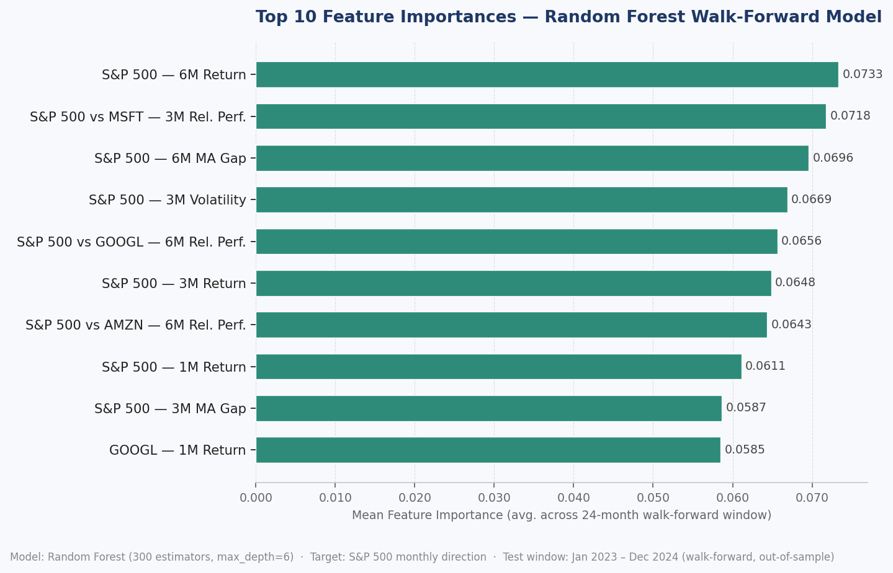

# AI Market Intelligence Workflow

A Python-based ML pipeline that automates market and macroeconomic data collection, feature engineering, walk-forward backtesting, and research-ready decision-support outputs.

> **Disclaimer:** This is a research prioritization and signal-screening tool, not a stand-alone investment engine. All outputs are for analyst review only.

---

## Overview

The pipeline ingests price data and macro indicators, engineers interpretable features, and runs a walk-forward Random Forest model to produce a directional signal with confidence scoring. Every step is structured for analyst handoff — not black-box prediction.



---

## Pipeline

```
Yahoo Finance (prices) ──┐
                          ├─► Merge & Resample ─► Feature Engineering ─► Walk-Forward Backtest ─► Outputs
FRED (macro indicators) ──┘
```

1. **Data ingestion** — monthly OHLCV from Yahoo Finance + 5 FRED macro series
2. **Feature engineering** — momentum, volatility, drawdown, MA gap, peer-relative performance, macro levels and changes
3. **Walk-forward backtesting** — rolling train/test splits over the last 24 months, one model per period
4. **Signal generation** — final model trained on all data, producing a directional signal + probability
5. **Structured outputs** — CSV, JSON, and a plain-language research brief

---

## Sample Output

```
Latest signal:  Down  (as of 2024-12-31)
P(up next month): 29.2%   Confidence: 41.7%
Walk-forward accuracy (24 months): 58.3%
Precision / Recall / F1: 66.7% / 75.0% / 70.6%

Top drivers:
  GSPC_ret_6m                    0.0733
  rel_perf_GSPC_vs_MSFT_3m       0.0718
  GSPC_ma_gap_6m                 0.0696
  GSPC_vol_3m                    0.0669
  rel_perf_GSPC_vs_GOOGL_6m      0.0656
```

See [examples/sample_output/](examples/sample_output/) for the full `research_brief.md` and `summary.json`.

---

## Features

**Market data**
- Downloads monthly close prices via `yfinance` for a target ticker and configurable peer tickers
- Default: S&P 500 (`^GSPC`) vs. MSFT, GOOGL, AMZN

**Macro indicators (FRED)**
| Series | Description |
|--------|-------------|
| `DFF` | Fed Funds Rate |
| `CPIAUCSL` | CPI (inflation) |
| `UNRATE` | Unemployment Rate |
| `UMCSENT` | Consumer Sentiment |
| `RSAFS` | Retail Sales |

**Engineered features**
- Return: 1m, 3m, 6m rolling
- Volatility: 3m, 6m rolling std
- MA gap: 3m, 6m price vs. moving average
- Drawdown: 12m rolling max
- Peer-relative performance: 3m and 6m vs. each peer
- Macro: level, 1m/3m change, 1/3-period lag

**Outputs**
| File | Contents |
|------|----------|
| `predictions.csv` | Month-by-month actual vs. predicted signal with `prob_up` |
| `feature_importance.csv` | Average feature importances across all walk-forward folds |
| `summary.json` | Config, metrics, latest signal, and top 10 features in machine-readable form |
| `research_brief.md` | Plain-language executive summary for analyst handoff |

---

## Project Structure

```
├── ai_market_intel.py         # Full pipeline (Config dataclass + MarketIntelligencePipeline)
├── plot_feature_importance.py # Standalone chart generator
├── feature_importance.png     # Sample feature importance chart
├── examples/
│   └── sample_output/         # Example run outputs (research_brief.md, summary.json)
└── requirements.txt
```

---

## Configuration

All parameters live in the `Config` dataclass at the top of [ai_market_intel.py](ai_market_intel.py). Key settings:

| Parameter | Default | Description |
|-----------|---------|-------------|
| `target_ticker` | `^GSPC` | Primary asset to model |
| `peer_tickers` | `MSFT, GOOGL, AMZN` | Peers for relative performance features |
| `start_date` | `2015-01-01` | Historical data start |
| `test_horizon_months` | `24` | Walk-forward test window length |
| `min_train_months` | `48` | Minimum training history required |
| `positive_threshold` | `0.55` | Probability cutoff for an "Up" signal |
| `output_dir` | `yellowwood_outputs` | Directory for all generated files |

---

## How to Run

```bash
python -m venv venv
source venv/bin/activate
pip install -r requirements.txt
python ai_market_intel.py
```

Outputs are written to `yellowwood_outputs/` by default.

---

## Tech Stack

- Python 3.10+
- [pandas](https://pandas.pydata.org/) — data manipulation and resampling
- [yfinance](https://github.com/ranaroussi/yfinance) — market price data
- [scikit-learn](https://scikit-learn.org/) — Random Forest classifier and metrics
- FRED public CSV API — macroeconomic indicators (no API key required)
